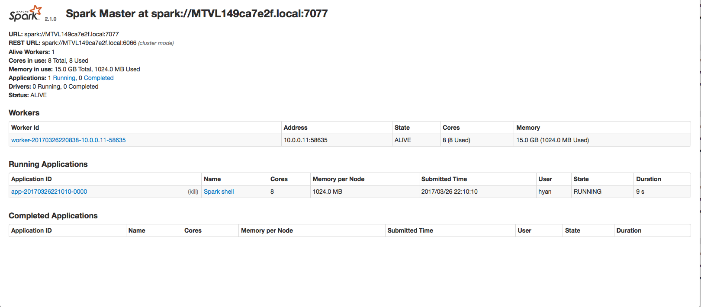

# Spark coding study

## How to start a spark master and slave and shell to connect to master

* Before launch spark master, we can enable log for spark
```
$ cd $SPARK_HOME 
$ cd conf 
$ cp spark-defaults.conf.template spark-defaults.conf

# Modify below attribute
spark.eventLog.enabled           true 
spark.eventLog.dir               <give a log directory location> 
```

* sh sbin/start-master.sh
  > Login [http://localhost:8080](./spark-master.png) to get spark master URL, let's assume it's spark://MTVL149ca7e2f.local:7077
  
* sh sbin/start-slave.sh spark://MTVL149ca7e2f.local:7077
* ./bin/spark-shell --master spark://MTVL149ca7e2f.local:7077
* ./bin/pyspark --master spark://MTVL149ca7e2f.local:7077

## A example to operate on RDD

Below is a example to operate on RDDn with spark-shell

```
val acTransList = Array("SB10001,1000", "SB10002,1200", "SB10003,8000", "SB10004,400", "SB10005,300", "SB10006,10000", "SB10007,500", "SB10008,56", "SB10009,30","SB10010,7000", "CR10001,7000", "SB10002,-10") 

// Create a RDD
val acTransRDD = sc.parallelize(acTransList)

// Filter out only the good transaction records from the list. The account number should start with SB and the transaction amount should be greater than zero
val goodTransRecords = acTransRDD.filter(_.split(",")(1).toDouble > 0).filter(_.split(",")(0).startsWith("SB")) 

val highValueTransRecords = goodTransRecords.filter(_.split(",")(1).toDouble > 1000)

val badAmountLambda = (trans: String) => trans.split(",")(1).toDouble <= 0 

val badAcNoLambda = (trans: String) => trans.split(",")(0).startsWith("SB") == false 

val badAmountRecords = acTransRDD.filter(badAmountLambda) 

val badAccountRecords = acTransRDD.filter(badAcNoLambda) 

val badTransRecords  = badAmountRecords.union(badAccountRecords) 

goodTransRecords.collect

badAmountRecords.collect

badAccountRecords.collect

badTransRecords.collect

val sumAmount = goodTransRecords.map(_.split(",")(1).toDouble).sum // goodTransRecords.map(_.split(",")(1).toDouble).reduce((sum, a) => sum + a)

val maxAmount = goodTransRecords.map(_.split(",")(1).toDouble).max // goodTransRecords.map(_.split(",")(1).toDouble).reduce((max, a) => if (a > max) a else max)

val minAmount = goodTransRecords.map(_.split(",")(1).toDouble).min // goodTransRecords.map(_.split(",")(1).toDouble).reduce((min, a) => if (a < min) a else min)

val combineAllElements = acTransRDD.flatMap(trans => trans.split(","))

val allGoodAccountNos = combineAllElements.filter(_.startsWith("SB"))

combineAllElements.collect

allGoodAccountNos.collect
```

Below is a example to operate on RDDn with pyspark
```
from decimal import Decimal 

acTransList = ["SB10001,1000", "SB10002,1200", "SB10003,8000", "SB10004,400", "SB10005,300", "SB10006,10000", "SB10007,500", "SB10008,56", "SB10009,30","SB10010,7000", "CR10001,7000", "SB10002,-10"] 

acTransRDD = sc.parallelize(acTransList) 

goodTransRecords = acTransRDD.filter(lambda trans: Decimal(trans.split(",")[1]) > 0).filter(lambda trans: (trans.split(",")[0]).startswith('SB') == True) 

highValueTransRecords = goodTransRecords.filter(lambda trans: Decimal(trans.split(",")[1]) > 1000) 

badAmountLambda = lambda trans: Decimal(trans.split(",")[1]) <= 0 

badAcNoLambda = lambda trans: (trans.split(",")[0]).startswith('SB') == False 

badAmountRecords = acTransRDD.filter(badAmountLambda) 

badAccountRecords = acTransRDD.filter(badAcNoLambda) 

badTransRecords  = badAmountRecords.union(badAccountRecords) 

acTransRDD.collect() 

goodTransRecords.collect() 

highValueTransRecords.collect() 

badAccountRecords.collect() 

badAmountRecords.collect() 

badTransRecords.collect() 

sumAmounts = goodTransRecords.map(lambda trans: Decimal(trans.split(",")[1])).reduce(lambda a,b : a+b) 

sumAmounts 

maxAmount = goodTransRecords.map(lambda trans: Decimal(trans.split(",")[1])).reduce(lambda a,b : a if a > b else b) 

maxAmount 

minAmount = goodTransRecords.map(lambda trans: Decimal(trans.split(",")[1])).reduce(lambda a,b : a if a < b else b) 

minAmount 

combineAllElements = acTransRDD.flatMap(lambda trans: trans.split(",")) 

combineAllElements.collect() 

allGoodAccountNos = combineAllElements.filter(lambda trans: trans.startswith('SB') == True) 

allGoodAccountNos.distinct().collect() 
```